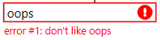
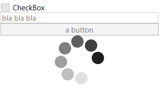

# Nir's MVVM Control Collection

This is a collection of WPF controls I wrote for various reasons, if there's demand I'll port those controls so they can be used also in "Store Apps"

Currently there are two controls in the library, more will be added over the next day as I move controls I previously published on my blog to here

There is a demo app that shows how to use each control

Adorners Lib
---

A set of controls that let you eaily add adorner-based popups that automatically adjust to your controls

Form Panel
---

A panel that arranges label-field pairs into a nice layout

This panel arranges the child elements so that labels are all the same size and inpt fields are all the same size, with configuable spacing.

It's also possible to have a control with no label (by settings FormPanel.IsStandalone="true") and have a group header that 
spans the entire width of the panel (FormPanel.IsGroupHeader="true")

Reflection Control
---

A decorator (like a border) that displays a reflection of it's child element

Speed Dial Style
---

A style that makes a ProgressBar control look like a car's speed dial

Validation Template
---

A template for showing validation errors, including error text and animated icon

Note you have to leave space below the control for the exception message

To apply:

    <UserControl.Resources>
        <ResourceDictionary>
            <ResourceDictionary.MergedDictionaries>
                <ResourceDictionary Source="pack://application:,,,/MvvmControls.Wpf;component/Validation/ValidationTemplate.xaml"/>
            </ResourceDictionary.MergedDictionaries>
            
        </ResourceDictionary>
    </UserControl.Resources>

Is Busy Decorator
---
A frame you put your controls into, if you set IsBusy to true all the controls will be disabled and a spinner will show on top of them (when IsBusy is false this control
does not change the display in any way)

Licensing
---

MvvmControls is copyrighted by Nir Dobovizki, it uses the MIT license.

If you use this library I would love to know about it (but you are not required to tell me), also for any questions or suggestions you can contact me at nir@nbdtech.com